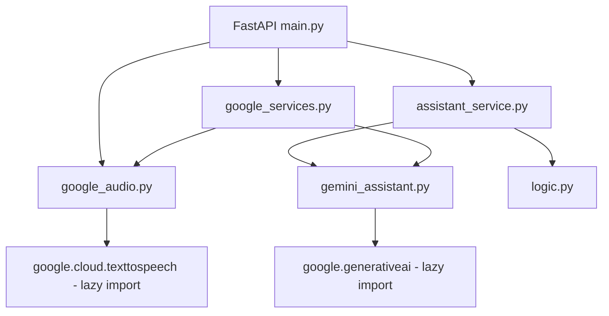

# Design Document

## Feature: code-quality-google-service-improvements

---

## Overview

This design covers targeted improvements to the `election-process-guide` FastAPI backend across two themes:

1. **Code Quality** — type annotations, structured logging, test coverage, and cache hygiene.
2. **Google Service Integration** — Gemini timeout handling, response-parser robustness, TTS observability, and service-status constants.

No existing behavior changes: the deterministic rule engine, bilingual content, security headers, accessibility, and validation all remain intact. The changes are additive or internal-only.

---

## Architecture

The server is a single-process FastAPI application. All Google integrations are optional and lazy-loaded. The architecture is unchanged; this work improves the internals of existing modules.



All Google library imports remain inside the functions that use them (never at module level), preserving fast startup when those libraries are absent.

---

## Components and Interfaces

### `gemini_assistant.py` — Changes

**Named constants** (new, module-level):
```python
REASON_READY = "ready"
REASON_MISSING_API_KEY = "missing_api_key"
REASON_LIBRARY_UNAVAILABLE = "library_unavailable"
```

**`gemini_service_status() -> dict[str, str | bool]`** — add explicit return type (already present), replace inline strings with constants.

**`_parse_labeled_lines(text: str) -> dict[str, str]`** — already case-insensitive and strips markdown fences. Confirm the `text.replace("```", "")` strip covers all fence variants. Add a broader strip for triple-backtick blocks with language tags (e.g., ` ```json `):
```python
import re
cleaned = re.sub(r"```[^\n]*\n?", "", text).strip()
```

**`enhance_guidance(...) -> tuple[GuideResult, Source]`** — add explicit return type annotation (already present). Add timeout via `request_options`:
```python
from google.api_core import retry as api_retry  # not needed
# pass as keyword:
response = model.generate_content(
    prompt,
    generation_config={"max_output_tokens": 280, "temperature": 0.35},
    request_options={"timeout": 10},
)
```
Extend the caught exception tuple to include timeout exceptions:
```python
from google.api_core.exceptions import DeadlineExceeded  # lazy, inside try block
except (ValueError, AttributeError, RuntimeError, DeadlineExceeded, TimeoutError) as exc:
    logger.warning("Gemini enhancement fell back to deterministic guidance: %s", exc)
    return base_result, "fallback"
```
`DeadlineExceeded` is imported lazily inside the `try` block (or at the top of the function body after the `import google.generativeai` line) to avoid a module-level import of `google.api_core`.

### `google_audio.py` — Changes

**Named constants** (new, module-level):
```python
REASON_READY = "ready"
REASON_DISABLED = "disabled"
REASON_MISSING_SERVICE_ACCOUNT_JSON = "missing_service_account_json"
REASON_LIBRARY_UNAVAILABLE = "library_unavailable"
REASON_INVALID_SERVICE_ACCOUNT_JSON = "invalid_service_account_json"
REASON_CLIENT_INITIALIZATION_FAILED = "client_initialization_failed"
```

**`_tts_client_status() -> tuple[object | None, str]`** — replace all inline reason strings with constants. Add `logger.warning` on initialization failure paths (currently silent). Add `logger.info` on successful initialization:
```python
logger.info("Google Cloud TTS client initialized successfully")
return client, REASON_READY
```
On `(ValueError, TypeError, json.JSONDecodeError)`:
```python
logger.warning("TTS client initialization failed: invalid service account JSON")
return None, REASON_INVALID_SERVICE_ACCOUNT_JSON
```

**`synthesize_speech(*, text: str, language: str) -> tuple[bytes | None, AudioProvider]`** — update the `except` block to include language and text-length context:
```python
except Exception:
    logger.exception(
        "Google Cloud TTS synthesis failed (language=%s, text_length=%d)",
        language,
        len(text),
    )
    return None, "fallback"
```

### `config.py` — Changes

Add explicit return-type annotations to all functions (some already have them):
- `_env_flag(name: str) -> bool` — already annotated
- `gemini_api_key() -> str | None` — already annotated
- `google_service_account_json() -> str | None` — already annotated
- `google_tts_enabled() -> bool` — already annotated
- `security_headers_enabled() -> bool` — already annotated
- `cors_origins() -> list[str]` — already annotated

Verify `from __future__ import annotations` is present (it is not currently — add it).

### `google_services.py` — Changes

Add explicit return-type annotations:
- `collect_google_service_statuses() -> ServiceStatuses`
- `assistant_mode_from_statuses(statuses: ServiceStatuses) -> Literal["gemini", "fallback"]`
- `audio_mode_from_statuses(statuses: ServiceStatuses) -> Literal["google", "browser"]`
- `available_google_features(statuses: ServiceStatuses) -> list[str]`
- `guide_google_features(statuses: ServiceStatuses, source: str) -> list[str]`

Add `from __future__ import annotations` if not present.

### `main.py` — Changes

Add explicit return-type annotations to middleware and helper functions:
- `add_security_headers(request: Request, call_next) -> Response` — already annotated
- `_service_status_response(data: dict[str, str | bool]) -> ServiceStatusResponse` — already annotated
- `_request_is_secure(request: Request) -> bool` — already annotated
- Route handlers: `health() -> HealthResponse`, `public_config() -> PublicConfigResponse`, `assistant_guide(body) -> GuideResponse`, `speak_audio(body) -> Response`, `index() -> FileResponse`, `styles() -> FileResponse`, `script() -> FileResponse` — verify all annotated.

Add `from __future__ import annotations` if not present (it is not currently).

### `assistant_service.py` — Changes

Add explicit return-type annotation:
- `build_assistant_response(body: AssistantGuideRequest) -> GuideResponse` — already annotated.

Add `from __future__ import annotations` if not present.

### `logic.py` — Changes

Add explicit return-type annotations:
- `_t(language: str, english: str, hindi: str) -> str`
- `_lookup(table: dict[str, dict[str, str]], key: str, language: str) -> str`
- `_localized_actions(language: str, concern: str) -> list[str]`
- `build_guidance(...) -> GuideResult` — already annotated.

Add `from __future__ import annotations` if not present.

### `schemas.py` — Changes

Add `from __future__ import annotations` if not present. All public methods already have annotations.

### `requirements.txt` — Changes

Add `pytest-cov`:
```
pytest-cov>=5.0.0
```

### `tests/test_server.py` — New Tests

Three new tests to reach ≥15 total:

**Test 14: `test_parse_labeled_lines_is_total_for_arbitrary_input`**
Verifies the total-function property: `_parse_labeled_lines` never raises and always returns a `dict` for any string input. Uses a set of representative arbitrary strings (empty string, whitespace, unicode, markdown fences, random garbage, partial labels).

**Test 15: `test_gemini_enhance_guidance_falls_back_on_value_error`**
Mocks `model.generate_content` to raise `ValueError`. Verifies `enhance_guidance` returns `(base_result, "fallback")` without raising.

**Test 16: `test_synthesize_speech_returns_fallback_on_tts_exception`**
Patches `_tts_client_status` to return a mock client object (non-None), then patches the TTS `synthesize_speech` inner call to raise `Exception`. Verifies `synthesize_speech` returns `(None, "fallback")`.

---

## Data Models

No new data models. The existing `GuideResult` dataclass and Pydantic schemas are unchanged.

**New module-level constants** (not data models, but structured data):

`gemini_assistant.py`:
```python
REASON_READY: str = "ready"
REASON_MISSING_API_KEY: str = "missing_api_key"
REASON_LIBRARY_UNAVAILABLE: str = "library_unavailable"
```

`google_audio.py`:
```python
REASON_READY: str = "ready"
REASON_DISABLED: str = "disabled"
REASON_MISSING_SERVICE_ACCOUNT_JSON: str = "missing_service_account_json"
REASON_LIBRARY_UNAVAILABLE: str = "library_unavailable"
REASON_INVALID_SERVICE_ACCOUNT_JSON: str = "invalid_service_account_json"
REASON_CLIENT_INITIALIZATION_FAILED: str = "client_initialization_failed"
```

---

## Correctness Properties

*A property is a characteristic or behavior that should hold true across all valid executions of a system — essentially, a formal statement about what the system should do. Properties serve as the bridge between human-readable specifications and machine-verifiable correctness guarantees.*

This feature is suitable for property-based testing in the following areas: the parser total-function guarantee, case-insensitive label matching, and timeout/exception fallback safety. The property-based testing library used is **[Hypothesis](https://hypothesis.readthedocs.io/)** (Python).

### Property 1: `_parse_labeled_lines` is a total function

*For any* string input (including empty strings, whitespace-only strings, unicode, markdown code fences, and malformed label text), `_parse_labeled_lines` SHALL return a `dict[str, str]` and SHALL NOT raise any exception.

**Validates: Requirements 3.3, 6.3**

### Property 2: Label matching is case-insensitive

*For any* string that contains a recognized label prefix (`summary:`, `reassurance:`, `verificationtip:`, `followupprompt:`) in any combination of upper and lower case, `_parse_labeled_lines` SHALL extract the corresponding value into the returned dict.

**Validates: Requirements 6.1**

### Property 3: Timeout exceptions always produce fallback

*For any* timeout-related exception type (`google.api_core.exceptions.DeadlineExceeded`, `TimeoutError`), when `enhance_guidance` is called and the underlying `model.generate_content` raises that exception, the function SHALL return `(base_result, "fallback")` and SHALL NOT propagate the exception to the caller.

**Validates: Requirements 5.2, 5.3**

### Property 4: Google service exceptions never propagate to callers

*For any* exception raised inside `enhance_guidance` or `synthesize_speech`, the function SHALL return the fallback result `(base_result, "fallback")` or `(None, "fallback")` respectively, and SHALL NOT raise an unhandled exception.

**Validates: Requirements 2.5**

---

## Error Handling

| Failure Scenario | Module | Current Behavior | After Change |
|---|---|---|---|
| Gemini API timeout | `gemini_assistant.py` | Falls through to generic `except Exception` | Caught by `(DeadlineExceeded, TimeoutError)` in named-exception tuple; `logger.warning` emitted |
| Gemini missing labeled lines | `gemini_assistant.py` | `ValueError` raised internally, caught | Unchanged; `logger.warning` already emitted |
| TTS init: invalid JSON | `google_audio.py` | Silent return of `REASON_INVALID_SERVICE_ACCOUNT_JSON` | `logger.warning` added before return |
| TTS init: success | `google_audio.py` | Silent | `logger.info` added |
| TTS synthesis exception | `google_audio.py` | `logger.exception` without context | `logger.exception` with `language` and `len(text)` |
| Gemini library unavailable | `gemini_assistant.py` | Cached, returns `REASON_LIBRARY_UNAVAILABLE` | Unchanged; uses constant |
| TTS library unavailable | `google_audio.py` | Cached, returns `REASON_LIBRARY_UNAVAILABLE` | Unchanged; uses constant |

All error paths return the fallback result. No exceptions propagate to the HTTP layer from Google service failures.

---

## Testing Strategy

### Dual Testing Approach

Unit tests cover specific examples, edge cases, and error conditions. Property-based tests (Hypothesis) verify universal properties across many generated inputs.

### Property-Based Testing

Library: **Hypothesis** (`hypothesis` package, already available or added to `requirements.txt` dev dependencies).

Each property test runs a minimum of 100 iterations (Hypothesis default is 100; `@settings(max_examples=100)` is explicit).

Tag format in test comments: `Feature: code-quality-google-service-improvements, Property {N}: {property_text}`

**Property 1 test** — `test_parse_labeled_lines_total_function_property`:
- Strategy: `hypothesis.strategies.text()` (arbitrary Unicode strings)
- Assert: return value is `dict`, no exception raised
- Tag: `Feature: code-quality-google-service-improvements, Property 1: _parse_labeled_lines is a total function`

**Property 2 test** — `test_parse_labeled_lines_case_insensitive_property`:
- Strategy: generate strings of the form `{random_case("Summary")}: {value}\n{random_case("Reassurance")}: {value2}` using `hypothesis.strategies.text()` for values and `hypothesis.strategies.sampled_from` for case variants
- Assert: returned dict contains `"summary"` and `"reassurance"` keys with correct values
- Tag: `Feature: code-quality-google-service-improvements, Property 2: Label matching is case-insensitive`

**Property 3 test** — `test_enhance_guidance_timeout_fallback_property`:
- Strategy: `hypothesis.strategies.sampled_from([DeadlineExceeded("timeout"), TimeoutError("timeout")])`
- Assert: returns `(base_result, "fallback")`, no exception raised
- Tag: `Feature: code-quality-google-service-improvements, Property 3: Timeout exceptions always produce fallback`

**Property 4 test** — `test_google_service_exceptions_never_propagate_property`:
- Strategy: `hypothesis.strategies.sampled_from([ValueError, RuntimeError, AttributeError, Exception])` — instantiate and raise from mock
- Assert: `enhance_guidance` and `synthesize_speech` always return fallback, never raise
- Tag: `Feature: code-quality-google-service-improvements, Property 4: Google service exceptions never propagate`

### Unit Tests (Example-Based)

The three new required tests (to reach ≥15 total) are:

1. **`test_parse_labeled_lines_is_total_for_arbitrary_input`** — calls `_parse_labeled_lines` with a representative set of tricky strings (empty, whitespace, unicode, fenced code blocks, partial labels) and asserts each returns a `dict` without raising. This satisfies Requirement 3.3 as an example-based test (the property test above provides the full PBT coverage).

2. **`test_gemini_enhance_guidance_falls_back_on_value_error`** — monkeypatches `google.generativeai.GenerativeModel.generate_content` to raise `ValueError("bad response")`. Calls `enhance_guidance(...)` with a valid `base_result`. Asserts return is `(base_result, "fallback")`.

3. **`test_synthesize_speech_returns_fallback_on_tts_exception`** — patches `_tts_client_status` to return `(mock_client, REASON_READY)` where `mock_client.synthesize_speech` raises `RuntimeError("network error")`. Calls `synthesize_speech(text="hello", language="en")`. Asserts return is `(None, "fallback")`.

### Coverage

Run from `election-process-guide/` directory:
```
pytest --cov=server --cov-report=term-missing
```

Expected modules in report: `main`, `assistant_service`, `gemini_assistant`, `google_audio`, `google_services`, `logic`, `config`, `schemas`.

`pytest-cov>=5.0.0` added to `requirements.txt`.

### Existing Tests

All 13 existing tests remain unchanged and continue to pass. The `reset_service_caches` fixture already calls `cache_clear()` on both `lru_cache`-decorated functions, satisfying Requirement 4.1.
